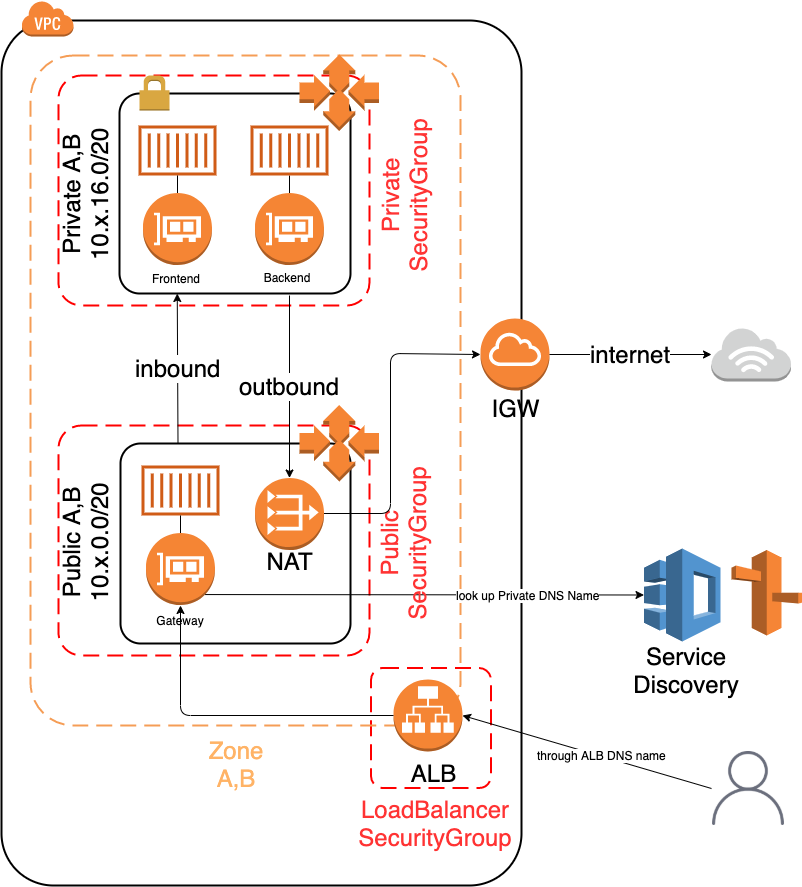

# Scalable AWS ECS Fargate using Apollo Server as example

## HOWTO
- If you want to test on the Premises, you can using docker-compose to run it.
- Using Cloudformation [Fargate Cluster](fargate-cluster.yaml) to create stack.

## Architecture


## Load testing with Apache Benchmark
- Populate data.txt with 
```graphql
{"query":"{ books { title } }"}
```
- Run the test
```shell script
ab -v 3 -n 10000 -c 10 -T 'application/json' -p data.txt ${ALB DNS}
```

## Reference
- [Scalable Fargate Service](https://templates.cloudonaut.io/en/stable/fargate/)
- [CloudFormation Templates for AWS Fargate deployments](https://github.com/nathanpeck/aws-cloudformation-fargate)
- [Independently Scalable Multi-Container Microservices Architecture on AWS Fargate (II)](https://hackernoon.com/microservices-on-fargate-part2-f29c6d4d708f)
